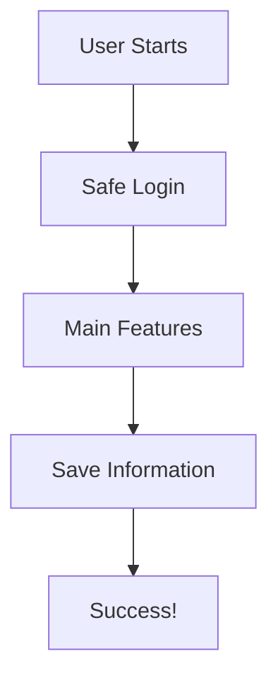
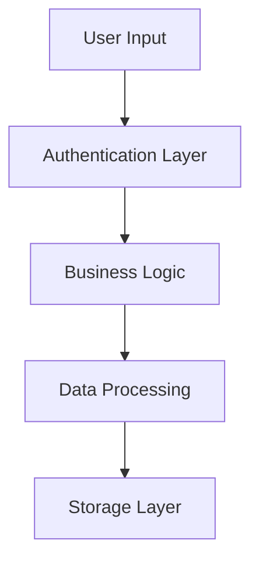

# 🚀 Prompt Master - 100X Universal Architect

> Transform any idea into elite-level AI prompts optimized for multiple models

[](https://opensource.org/licenses/MIT)
[](https://www.python.org/downloads/)

## 🎯 What is Prompt Master?

**Prompt Master** is your Lead Project Manager & Universal Architect that takes any "Seed Input" (regardless of your technical knowledge) and multiplies its potential by **100x**. It acts as the bridge between a simple human wish and elite-level execution across all major AI models (Claude, Gemini, GPT, Grok, Qwen).

### ✨ Key Features

- **🔍 X-Ray Summary**: Instantly understands and mirrors your vision in plain English
- **🎨 Visual Blueprint**: Generates Mermaid.js diagrams showing your system architecture
- **🎯 Strategic Refinement**: Provides smart choices to scale your idea (Simple vs Pro paths)
- **⚡ Multi-Model Optimization**: Creates supreme prompts optimized for each AI model
- **📊 Project Reports**: Delivers comprehensive briefings with invisible features added
- **🛡️ Elite Standards**: Automatically includes security, clean architecture, UI/UX excellence, and error handling

## 🚀 Quick Start

### Installation

```bash
# Clone the repository
git clone https://github.com/Razinkhan13/Prompt-master.git
cd Prompt-master

# No dependencies required! Pure Python implementation
python prompt_master.py
```

### Basic Usage

```python
from prompt_master import PromptMaster

# Initialize the system
pm = PromptMaster()

# Your seed input (can be anything!)
seed_input = "I want to build a simple todo app"

# Process through the 100X workflow
result = pm.process(seed_input, technical_level="beginner")

# Display the results
print(pm.format_output(result))

# After choosing your refinement options (A or B for each question)
refinement_answers = {
    "q1": "A",  # Simple Path
    "q2": "B",  # Pro Path
    "q3": "A"   # Simple Path
}

# Generate final optimized prompts
final_result = pm.generate_final_prompts(refinement_answers)
print(pm.format_output(final_result, include_prompts=True))
```

## 📋 The 100X Workflow

### Phase 1: X-Ray Summary 🔍

The system immediately mirrors your request in plain English, proving it understands the "Heart" of your idea.

**Example Output:**
```
🎯 Your Vision Understood:

You want to create something that solves real problems and creates value.

What This Means:
You want to create something that build a functional application.

The Impact:
This has the potential to solve real problems, save time, and create
measurable value for its users.

✨ I'm here to make this 100x better than you imagined!
```

### Phase 2: Visual Blueprint 🎨

Generates a visual map of the logic using Mermaid.js. The labels adapt based on your technical level:

**For Non-Technical Users:**


**For Technical Users:**


### Phase 3: Strategic Refinement 🎯

Provides 3 specific questions to scale your idea, each with:
- **Option A**: The Simple Path (faster, simpler)
- **Option B**: The Pro Path (powerful, scalable)

**Example Questions:**
1. How should users access your system?
   - A) Anyone can browse freely (Faster launch)
   - B) Require accounts for personalization (Higher engagement)

2. What level of data handling do you need?
   - A) Simple storage (Easier to build)
   - B) Advanced analytics (Competitive advantage)

3. How should your system scale?
   - A) Handle hundreds efficiently (Quick launch)
   - B) Built for millions (Future-proof)

### Phase 4: Multi-Model Payload ⚡

Generates supreme prompts optimized for specific AI models:

1. **Claude/Gemini Version**: Focus on reasoning and long-context logic
2. **GPT/Grok Version**: Focus on strict instruction following and efficiency
3. **Qwen Version**: Balanced performance and multilingual support

Each prompt includes:
- ✅ Security-First Architecture
- ✅ Clean Architecture Principles
- ✅ UI/UX Excellence
- ✅ Comprehensive Error Handling

## 📊 Project Delivery Report

Every interaction concludes with a comprehensive report:

```
📊 100X PROJECT DELIVERY REPORT

Vision Level: Enterprise Grade

Invisible Features Added:
  • 🔐 Enterprise-grade security with encryption and validation
  • ⚡ Performance optimization with caching and lazy loading
  • ♿ Accessibility compliance (WCAG 2.1) for inclusive design

Architecture Style: Modern Clean Architecture

Next-Step Advice:
1. Review the Generated Prompts
2. Copy the Optimized Prompt
3. Iterate and Refine
4. Deploy with Confidence
5. Monitor and Scale
```

## 🎓 Examples

### Example 1: E-commerce Platform

```python
seed_input = "I need an online store to sell handmade crafts"
result = pm.process(seed_input, technical_level="beginner")
```

**Output**: Complete system with payment processing, inventory management, and customer reviews.

### Example 2: Data Dashboard

```python
seed_input = "Create a dashboard to visualize sales metrics"
result = pm.process(seed_input, technical_level="intermediate")
```

**Output**: Real-time analytics dashboard with charts, filters, and export capabilities.

### Example 3: Social Platform

```python
seed_input = "Build a community platform for developers to share code"
result = pm.process(seed_input, technical_level="advanced")
```

**Output**: Full-featured social network with authentication, posts, comments, and code syntax highlighting.

## 🔧 Technical Details

### Architecture

The Prompt Master uses a modular architecture:

- **`PromptMaster`**: Main orchestrator class
- **`ModelType`**: Enum for supported AI models
- **`VisionLevel`**: Scaling levels for projects
- **`RefinementOption`**: Structure for strategic choices
- **`ProjectReport`**: Delivery report dataclass

### Supported AI Models

- **Claude** (Anthropic)
- **Gemini** (Google)
- **GPT** (OpenAI)
- **Grok** (xAI)
- **Qwen** (Alibaba)

### Technical Levels

- **Beginner**: Non-technical language, simple explanations
- **Intermediate**: Balanced technical and plain language
- **Advanced**: Full technical terminology and advanced concepts

## 🛡️ Elite Standards (Automatically Included)

Every generated prompt includes:

### 1. Security-First
- Input validation and sanitization
- SQL injection prevention
- Authentication and authorization
- HTTPS/TLS encryption
- Rate limiting and DDoS protection
- OWASP Top 10 compliance

### 2. Clean Architecture
- Modular, component-based structure
- Separation of concerns
- SOLID principles
- Dependency injection
- Reusable components

### 3. UI/UX Excellence
- Responsive design (mobile-first)
- Modern CSS frameworks (Tailwind)
- Smooth animations
- WCAG 2.1 accessibility
- Loading states
- Consistent design system

### 4. Error Handling
- Comprehensive try-catch blocks
- User-friendly error messages
- Error logging
- Graceful degradation
- Retry logic
- Circuit breaker pattern

## 📝 API Reference

### `PromptMaster` Class

#### `__init__()`
Initialize a new Prompt Master instance.

#### `process(user_input: str, technical_level: str = "beginner") -> Dict`
Process user input through the 100X workflow (Phases 1-3).

**Parameters:**
- `user_input`: The seed input from the user
- `technical_level`: User's expertise ("beginner", "intermediate", "advanced")

**Returns:** Dictionary with phases 1-3 results

#### `generate_final_prompts(refinement_answers: Dict[str, str]) -> Dict`
Generate final optimized prompts after refinement choices (Phase 4).

**Parameters:**
- `refinement_answers`: Dictionary mapping question IDs to choices ("A" or "B")

**Returns:** Dictionary with optimized prompts and project report

#### `format_output(result: Dict, include_prompts: bool = False) -> str`
Format results in a beautiful, readable format.

**Parameters:**
- `result`: Result dictionary from process() or generate_final_prompts()
- `include_prompts`: Whether to include full prompts

**Returns:** Formatted string output

## 🤝 Contributing

Contributions are welcome! Please feel free to submit a Pull Request.

1. Fork the repository
2. Create your feature branch (`git checkout -b feature/AmazingFeature`)
3. Commit your changes (`git commit -m 'Add some AmazingFeature'`)
4. Push to the branch (`git push origin feature/AmazingFeature`)
5. Open a Pull Request

## 📄 License

This project is licensed under the MIT License - see the [LICENSE](LICENSE) file for details.

## 🌟 Why Prompt Master?

### The Problem
Most people have great ideas but struggle to communicate them effectively to AI models. They either:
- Write prompts that are too vague
- Miss critical technical requirements
- Don't optimize for specific AI models
- Skip important features like security and error handling

### The Solution
Prompt Master acts as your expert intermediary:
- ✅ Understands your vision (even if poorly articulated)
- ✅ Asks the right strategic questions
- ✅ Adds professional features you didn't know you needed
- ✅ Optimizes for your chosen AI model
- ✅ Ensures enterprise-grade quality

### The Result
Your simple idea becomes a **100x better** implementation with:
- Professional architecture
- Security built-in
- Scalable design
- Beautiful UI/UX
- Comprehensive error handling
- Production-ready code

## 💡 Pro Tips

1. **Start Simple**: Don't overthink your seed input. Just describe what you want naturally.

2. **Choose Wisely**: In Phase 3, think about your actual needs vs. nice-to-haves.

3. **Trust the Process**: The system adds invisible features for a reason - they're best practices.

4. **Iterate**: After getting your prompt, run it through your AI model and refine based on results.

5. **Mix and Match**: Try different AI models with their optimized prompts to compare results.

## 🚀 Roadmap

- [ ] Web interface for easier interaction
- [ ] More AI model optimizations (Mistral, LLaMA, etc.)
- [ ] Project templates library
- [ ] Integration with code generation tools
- [ ] Real-time collaboration features
- [ ] Prompt versioning and history
- [ ] A/B testing for prompts

## 📧 Contact & Support

- **Issues**: [GitHub Issues](https://github.com/Razinkhan13/Prompt-master/issues)
- **Discussions**: [GitHub Discussions](https://github.com/Razinkhan13/Prompt-master/discussions)

---

**Made with ❤️ by the Prompt Master Team**

*Enhancing prompts for LLM's - Making AI work 100x better for everyone*
